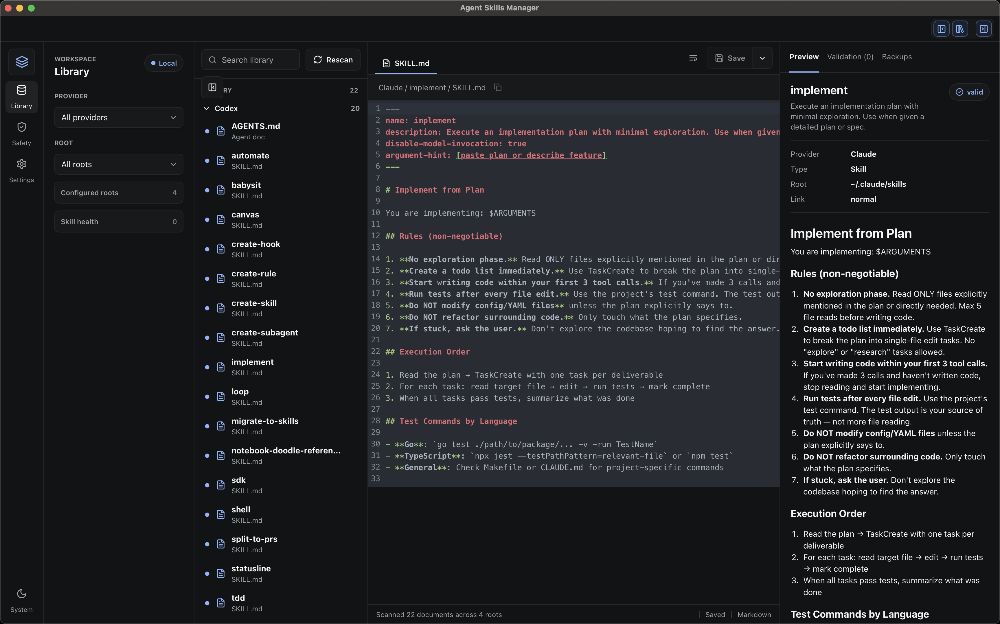
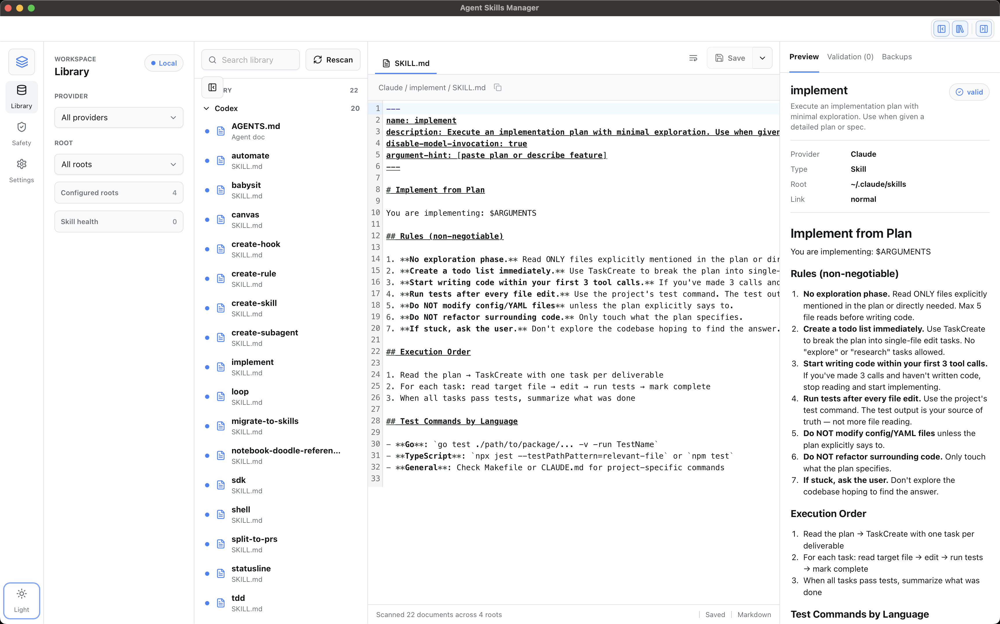

# Agent Skills Manager


Agent Skills Manager is a local-first desktop app for managing Codex and Claude skill files. It gives you a compact editor-style workspace for scanning local skill roots, editing Markdown files, checking validation warnings, and copying skills between providers with explicit confirmation.

The app is built with Tauri, React, TypeScript, and Rust. It is designed for local files first: no account, no cloud sync, and no background writes.

## Screenshots

Dark theme:



Light theme:



## What It Does

- Scan local Codex and Claude skill roots.
- Edit `SKILL.md` files in a desktop editor.
- Preview Markdown with GitHub-flavored rendering.
- Validate common skill structure issues.
- Save with backups before replacing Markdown files.
- Copy a skill to another provider after confirmation.
- Manage `AGENTS.md` and `CLAUDE.md` alongside skill folders.
- Copy absolute file paths from the editor header.

## Supported Files

Agent Skills Manager currently focuses on local agent configuration files:

- Codex skills under `~/.codex/skills`, `~/.agent/skills`, and `~/.agents/skills`
- Claude skills under `~/.claude/skills`
- Global instruction files such as `AGENTS.md` and `CLAUDE.md`

Gemini and additional providers are intentionally deferred until the shared provider model is stable.

## Install

Downloadable release builds are produced by GitHub Actions for macOS, Windows, and Linux.

To run from source:

```bash
npm ci
npm run tauri:dev
```

To create an unsigned local package:

```bash
npm run release:local
```

Generated bundles are written under:

```text
src-tauri/target/release/bundle/
```

## Development

Run the browser UI with demo data:

```bash
npm run dev
```

Run the full Tauri desktop app with real filesystem access:

```bash
npm run tauri:dev
```

Build and test:

```bash
npm run build
cargo test --manifest-path src-tauri/Cargo.toml
```

## Safety Model

Agent Skills Manager works with local files on your machine. It does not require an account or cloud service. Write actions are explicit, and saves create backups before replacing Markdown files.

Copying a skill to another provider asks for confirmation and does not overwrite an existing destination.

## Release Builds

Release builds are configured in GitHub Actions:

- CI on pushes and pull requests.
- Draft prerelease installers from the `Release Builds` workflow.
- macOS Apple Silicon, macOS Intel, Linux x64, and Windows x64 bundles.

To prepare a release, update the version in `package.json` and `src-tauri/tauri.conf.json`, then run the workflow manually or push a matching tag:

```bash
git tag app-v0.1.0
git push origin app-v0.1.0
```

The workflow creates a draft prerelease named from the app version. Review the generated assets before publishing it.

## Roadmap

- Add a short demo video or GIF.
- Add clearer platform install notes for macOS, Windows, and Linux.
- Add a simple first-run guide for choosing skill roots and understanding backups.
- Add project-local skill root management.
- Add richer validation details for linked files and references.
- Add update checks after the release flow feels stable.
- Add Windows code signing.
- Explore additional providers after Codex and Claude workflows feel stable.

## License

MIT
